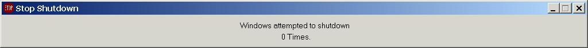



## SOMETHING NEW \! STOP WINDOWS FROM SHUTTING DOWN \!

### Description

Have you ever had the problem, that, while you were surfing the net, suddenly, BLAAAM, a hacker (or friend, hello Martin ...) nuked you and remotely shutted dwon your computer ? Well, no more, since this little proggie intercepts the Shutdown-Message sent by Windows and sends a message back to Windows that it cannot shut down right now ! Uses Sub-Classing to intercept the WM_QUERYENDSESSION Message.
 
### More Info
 
If this is not the FIRST PROGRAM in the Taskbar, the programs on the left of it WILL BE shut down, since they usually cannot answer the Message from Windows.

             |
---                |---
**Submitted On**   |2001-08-28 09:26:58
**By**             |[Thomas Sturm](https://github.com/Planet-Source-Code/PSCIndex/blob/master/ByAuthor/thomas-sturm.md)
**Level**          |Advanced
**User Rating**    |4.7 (28 globes from 6 users)
**Compatibility**  |VB 6\.0
**Category**       |[Windows System Services](https://github.com/Planet-Source-Code/PSCIndex/blob/master/ByCategory/windows-system-services__1-35.md)
**World**          |[Visual Basic](https://github.com/Planet-Source-Code/PSCIndex/blob/master/ByWorld/visual-basic.md)
**Archive File**   |[SOMETHING 254578282001\.zip](https://github.com/Planet-Source-Code/thomas-sturm-something-new-stop-windows-from-shutting-down__1-26713/archive/master.zip)

### API Declarations

Only 3 !

